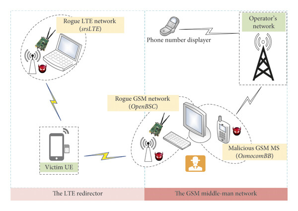
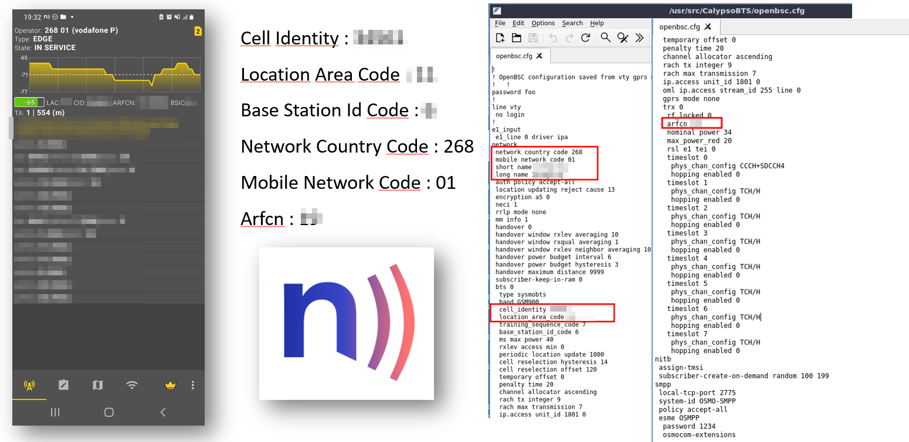
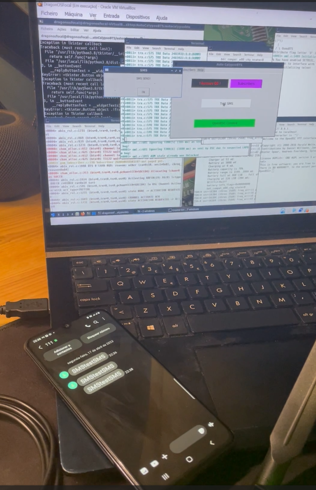
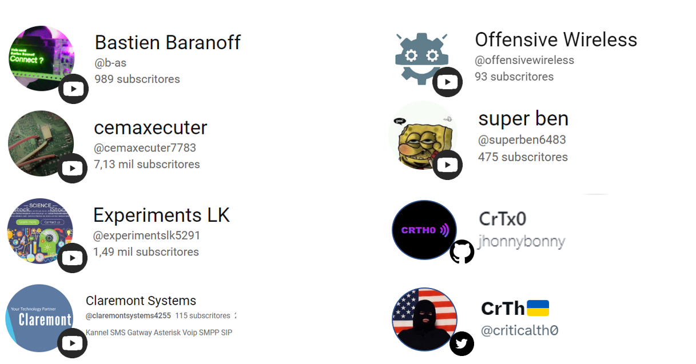

## Exploring 2G Network Implementation and Mobile Privacy Risks

### Introduction  
A few years ago, I began questioning whether it would be possible to scale an IMSI catcher application to identify the digital identity of individuals nearby. The goal was to capture phone numbers and correlate them with various leaked information sources.  
During this research, I came across an incredible paper that inspired my project: [*LTE Phone Number Catcher: A Practical Attack against Mobile Privacy*](https://onlinelibrary.wiley.com/doi/10.1155/2019/7425235). This article demonstrated that mobile privacy remains vulnerable even in LTE networks as long as legacy GSM networks exist.

### Summary of LTE Phone Number Catcher  
The research highlighted that a mobile subscriber's phone number serves as a unique identifier in social networks. Unlike the IMSI, a phone number is never transmitted by the mobile device itself but may be shared when initiating a call or SMS.  
By leveraging an IMSI catcher and a 2G man-in-the-middle attack, the researchers developed a functional phone number catcher prototype for LTE phones. They demonstrated that once a device camped on their rogue station, they could capture its phone number within seconds. Furthermore, the study emphasized that anyone with basic programming skills and knowledge of GSM/LTE specifications could build a similar setup using SDR tools and commercial off-the-shelf equipment. The authors advocated for the global deactivation of GSM networks in areas covered by 3G and 4G to mitigate these risks.

### 2G Network Implementation  
Due to hardware limitations—specifically, having only a HackRF, which operates in half-duplex mode—I was unable to implement the phone number-catching attack. However, I gained valuable insights into [OSMOCOM BB](https://osmocom.org/projects/baseband) and decided to focus on building a 2G network instead.  
To achieve this, I acquired two Motorola C123 devices and two Sysmocom USB Serial Cable [CP2102](https://shop.sysmocom.de/Sysmocom-USB-serial-cable-CP2102-with-2.5mm-stereo-jack/cp2102-25) adapters. Initially, setting up a 2G network using OSMOCOM was complex due to my lack of experience. However, I discovered AutoCalypsoBTS, a project that significantly simplified the deployment process. Later, I refined my network setup using the [work](https://pl4y.readthedocs.io/en/latest/) of [Bastien Baranoff](https://github.com/bbaranoff), which I will detail in a future article.

### Overview of 2G Network Architecture  
GSM (2G) networks operate on a well-defined architecture consisting of:  
- **Base Transceiver Station (BTS):** Handles radio communication with mobile devices.  
- **Base Station Controller (BSC):** Manages multiple BTS units.  
- **Mobile Switching Center (MSC):** Connects calls and routes messages.  
- **Home Location Register (HLR) & Visitor Location Register (VLR):** Store subscriber information and track locations.  
A detailed discussion of mobile network architectures is beyond the scope of this paper. However, for a comprehensive overview of 2G, 3G, and 4G architectures, I recommend this insightful article: [Architecture of Mobile Networks (2G, 3G, 4G)](https://www.linkedin.com/pulse/architecture-mobile-networks-2g-3g-4g-ilyes-amokrane-lezzoum-tyofe/).

### Implementation of AutoCalypsoBTS  
Using [AutoCalypsoBTS](https://github.com/jhonnybonny/AutoCalypsoBTS), I installed [NetMonitor](https://play.google.com/store/apps/details?id=com.parizene.netmonitor) on an Android device. This application provided advanced insights into 2G/3G/4G/5G networks, including:  
- Cell Identify (CID)  
- Local Area Code (LAC)  
- Base Station ID Code (BSIC)  
- Network Country Code (NCC)  
- Mobile Network Code (MNC)  
- Absolute Radio Frequency Channel Number (ARFCN)  

By collecting these details, I could simulate a nearby cell tower. Setting my smartphone to 2G mode ensured it connected only to my network.

### SMS Network Testing  
Once my device successfully connected to the 2G network, I used [Ozeki SMS Gateway](https://ozeki.hu/) to send spoofed messages within the network. This allowed me to test message injection capabilities by impersonating different entities or contacts.

POC [here](https://youtube.com/shorts/79TxvL925-o?si=1KFk9urKHfrElaAt) 

### Learning Experience and Ethical Considerations  
When I started this project, I had zero networking experience. The entire endeavor was a learning process, heavily reliant on publicly available resources and tutorials from various YouTube creators. I strongly encourage others interested in security research to explore similar projects while adhering to ethical guidelines and legal frameworks.

### References  

